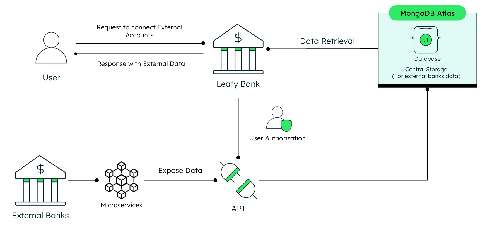

# Leafy Bank Open Finance (Backend)

This repository hosts the backend for Leafy Bank's Open Finance demo service. It demonstrates integration with third-party banks and showcases secure data exchange. MongoDB serves as the central data store. This code may include simplified or emulated components for demonstration purposes.

## What is Open Finance?

Open Finance refers to the concept of allowing customers to securely share their financial data with third parties, beyond traditional banking services, to enable a broader range of financial products and services. It builds upon the principles of Open Banking, which focuses primarily on bank accounts, but extends the scope to include other financial products such as investments, insurance, mortgages, and loans.

## Where Does MongoDB Shine?

MongoDB shines in its flexibility—serving as a central data storage solution for retrieving data from external financial institutions while seamlessly supporting diverse formats and structures. By leveraging MongoDB’s flexible schema and BSON format (Binary JSON), it efficiently handles varied data types without the overhead of serialization or deserialization. This ensures smooth data processing and compatibility with API communication in JSON format, making it an ideal choice for aggregating data from multiple sources with different schemas.

## High Level Architecture



## What are we doing behind the scenes?

This repository contains the backend **Open Finance Demo API** for the **Leafy Bank**, which is part of a larger microservices architecture powering the demo application. The goal is to demonstrate how **MongoDB can serve as the backbone of an Open Finance ecosystem by acting as a flexible and efficient central data store.**

## Key Features

### MongoDB as Central Storage:

- Uses MongoDB's flexible schema to store diverse datasets, including internal bank records and external financial data such as accounts and products, without rigid data models.
- Ensures compatibility with the JSON format, the de facto standard for API communication, while leveraging MongoDB’s BSON (Binary JSON) storage format. This eliminates the need for serialization and deserialization, resulting in efficient data processing and seamless integration between APIs and storage.
- Supports [aggregation queries using MongoDB pipelines](https://www.mongodb.com/resources/products/capabilities/aggregation-pipeline) to merge and process data for calculations like total balances and debts.

### API Functionality:

Public and secure APIs allow emulation of Open Finance use cases such as fetching external accounts and products, simulating data retrieval from external institutions, and calculating global financial metrics for users. Some of the key endpoints include:

### Open Finance Public Endpoint

- `/api/v1/openfinance/public/get-authorization`: Get bearer token for authentication to secure APIs.

### Open Finance Secure Endpoints

- `/api/v1/openfinance/secure/fetch-external-accounts-for-user-and-institution`: Retrieve external account data for authenticated users from connected institutions.
- `/api/v1/openfinance/secure/fetch-external-products-for-user-and-institution`: Retrieve external financial product data for authenticated users from connected institutions.
- `/api/v1/openfinance/secure/fetch-external-accounts-for-user`: Retrieve external account data for authenticated users from connected institutions.
- `/api/v1/openfinance/secure/fetch-external-products-for-user`: Retrieve external financial product data for authenticated users from connected institutions.
- `/api/v1/openfinance/secure/calculate-total-balance-for-user`: Calculate total balances across internal and external accounts.
- `/api/v1/openfinance/secure/calculate-debt-balance-for-user`: Calculate total debt across connected external financial products.

### Leafy Bank Secure Endpoints

- `/api/v1/leafybank/accounts/secure/fetch-accounts-for-user`: Retrieve internal account data for authenticated users.
- `/api/v1/leafybank/transactions/secure/fetch-recent-transactions-for-user`: Retrieve recent transaction data for authenticated users.

To know more about the API endpoints, you can access the Swagger documentation.

### Simplified Aggregation Services

- Modular services handle aggregation of account and product data from MongoDB. This includes:
  - Aggregating internal and external account balances.
  - Calculating total debt for connected external financial products.
- These services mimic real-world multi-source data orchestration, highlighting MongoDB’s suitability for unifying diverse datasets.

### Security and Rate Limiting

- Implements Bearer Token authentication to emulate secure access.
- Integrates SlowAPI for rate limiting, ensuring APIs are protected against abuse.

### Microservices Integration

This backend service integrates with other microservices in the Leafy Bank architecture (e.g., a frontend service and additional internal APIs), collectively simulating the operations of a modern Open Finance platform.

## Tech Stack

- [MongoDB Atlas](https://www.mongodb.com/atlas/database) for the database
- [FastAPI](https://fastapi.tiangolo.com/) for the backend framework
- [Pydantic](https://pydantic-docs.helpmanual.io/) for documenting FastAPI Swagger schemas
- [SlowApi](https://slowapi.readthedocs.io/en/latest/) for rate limiting
- [Uvicorn](https://www.uvicorn.org/) for ASGI server
- [Poetry](https://python-poetry.org/) for dependency management
- [Docker](https://www.docker.com/) for containerization

## Prerequisites

Before you begin, ensure you have met the following requirements:

- MongoDB Atlas account, you can create one [here](https://account.mongodb.com/account/register). Free tier is sufficient for this project.
- Python 3.10 or higher (but less than 3.11)
- Poetry (install via [Poetry's official documentation](https://python-poetry.org/docs/#installation))

## Setup Instructions

### Step 1: Set Up MongoDB Database and Collections

1. Log in to [MongoDB Atlas](https://account.mongodb.com/account/login) and create a new database named `open_finance`. You can use another name if you prefer, but make sure to update all database name references in the code and environment variables.
2. Inside this database, create a 3 (three) empty collections:
    - `tokens`
    - `external_accounts`
    - `external_products`
3. Import the sample data from the `/backend/data/sample` directory into the respective collections.

> **_Note:_** This service is integrated with other services in the Leafy Bank microservices architecture. If you haven’t set up the Leafy Bank internal database yet, follow the instructions [here](https://github.com/mongodb-industry-solutions/leafy-bank-backend-transactions/tree/main?tab=readme-ov-file#step-1-set-up-mongodb-database-and-collections).

To learn more about the other services in the Leafy Bank architecture, check out the [Leafy Bank UI repository](https://github.com/mongodb-industry-solutions/leafy-bank-ui)

### Step 2: Add MongoDB User

- Create a new MongoDB user with read and write access to the `open_finance` database. You can follow the official MongoDB documentation to create a new user. You can find the instructions [here](https://www.mongodb.com/docs/atlas/security-add-mongodb-users/).

#### From the GUI, you can follow these steps:
1. Access your cluster.
2. Under the `Security` tab, click on `Database Access`.
3. Click on `Add New Database User or User Group`.
4. Fill in the user details and set the password.
5. Under `Database User Privileges` -> `Add Specific Privileges`, select `readWrite` for the `open_finance` database, and you can select `*` for all collections.
6. Click on `Add User`.

> **_Note:_** Don't forget to save the username and password. You will need them to connect to the database.

### Add environment variables

> **_Note:_** Create a `.env` file within the `/backend` directory.

```bash
MONGODB_URI = "mongodb+srv://<REPLACE_USERNAME>:<REPLACE_PASSWORD>@<REPLACE_CLUSTER_NAME>.mongodb.net/"
OPENFINANCE_DB_NAME = "open_finance"
LEAFYBANK_DB_NAME = "leafy_bank"
ORIGINS=http://localhost:3000
```

## Run it Locally

### Setup virtual environment with Poetry

1. (Optional) Set your project description and author information in the `pyproject.toml` file:
   ```toml
   description = "Your Description"
   authors = ["Your Name <you@example.com>"]
2. Open the project in your preferred IDE.
3. Open a Terminal window.
4. Ensure you are in the root project directory where the `makefile` is located.
5. Execute the following commands:
  - Poetry start
    ````bash
    make poetry_start
    ````
  - Poetry install
    ````bash
    make poetry_install
    ````
6. Verify that the `.venv` folder has been generated within the `/backend` directory.

### Run the Backend

1. To run the backend, execute the following command:
    ````bash
    poetry run uvicorn main:app --host 0.0.0.0 --port 8003
    ````

> **_Note:_** Notice that the backend is running on port `8003`. You can change this port by modifying the `--port` flag.

## Run with Docker

Make sure to run this on the root directory.

1. To run with Docker use the following command:
```
make build
```
2. To delete the container and image run:
```
make clean
```

## API Documentation

You can access the API documentation by visiting the following URL:

```
http://localhost:<PORT_NUMBER>/docs
```
E.g. `http://localhost:8003/docs`

> **_Note:_** Make sure to replace `<PORT_NUMBER>` with the port number you are using and ensure the backend is running.

## Common errors

- Check that you've created an `.env` file that contains the `MONGODB_URI` and `ORIGINS` variables.

## Future tasks

- [ ] Add tests
- [ ] Evaluate SonarQube for code quality
- [ ] Automate the deployment process using GitHub Actions or CodePipeline
- [ ] Improve Pydantic usage for API Request and Response models